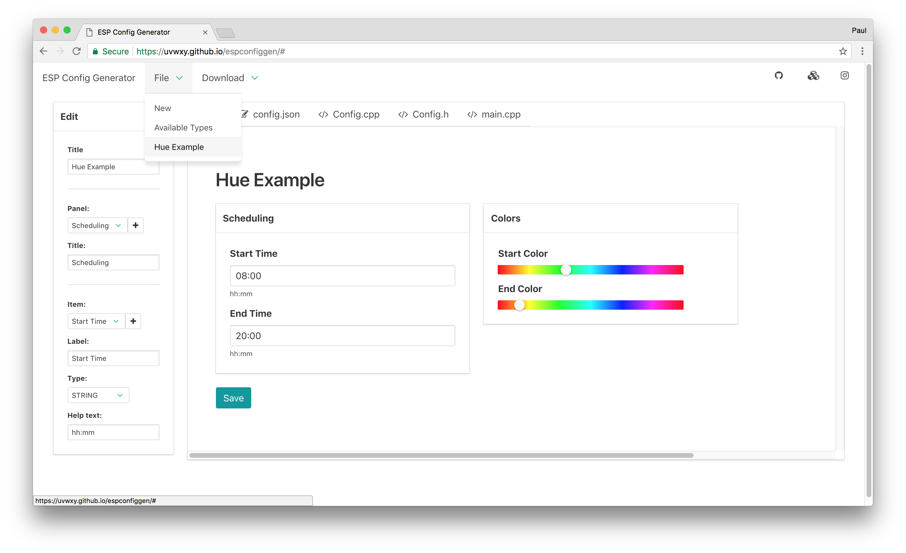
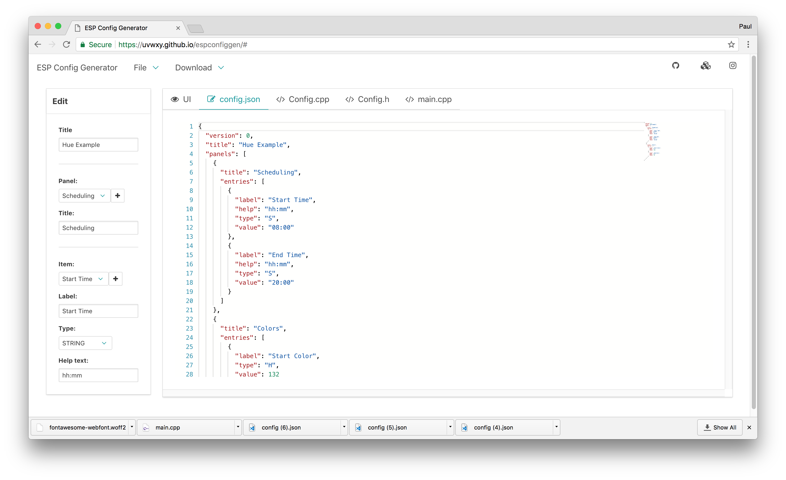
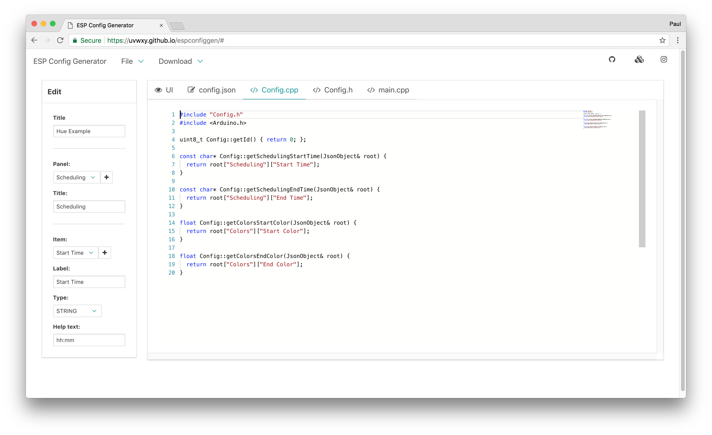
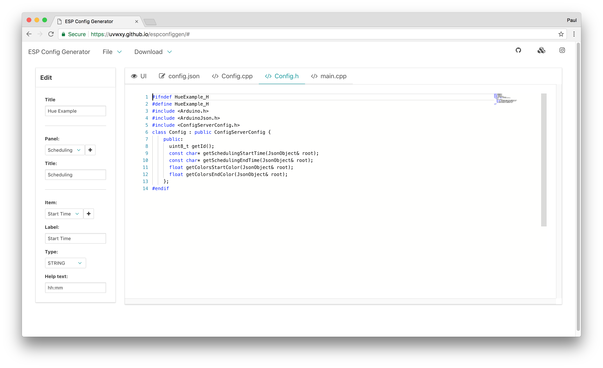
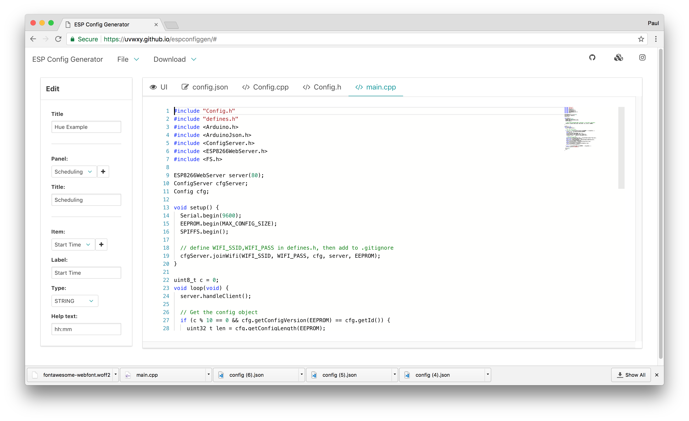

# Config Generator for ESP/Arduino

Everyone with an ESP8266 lying around has an awesome idea what to do with it 😎 and all of you have probably figured out how to tackle the core problem of it. Maybe it's triggering a servo/motor/LED/speaker, or how to read a sensor. There is a library for almost everything. What I think is missing is an easy way to nicely configure an ESP via a webfronted hosted from the device itself, without any external dependencies. So I started this:







This is

- an editor to create a configuration UI (with live preview)
- a code generator that creates code from the created UI to host/load/save and configure an ESP via HTTP
- (the load/save config part is still TODO)

## Quick Start

Clone this repository.

```bash
cd generator
npm install

npm run build # compile for prod -> use this to obtain dist/data/*.gz
#or
npm run start # run dev server
```

Open [http://localhost:8081](http://localhost:8081)

Create your UI and download the `config.json` file to `generator/dist/data`, then copy the data directory to `example`:

```bash
mkdir example/data
cp generator/dist/data/* example/data/
```

The `example/` directory contains a [platformio.org](https://plaformio.org) based Arduino project for the ESP8266.

From the copied `example/data` directory create the SPIFFS image

```bash
cd example/
pio run --target buildfs
```

Connect your ESP8266 and upload the SPIFFS image:

```bash
pio run --target uploadfs
```

Create your own `src/config.h` from `src/config.h.example` so the ESP can connect to your WiFi.
Compile the project and upload it to the ESP via the IDE.

Open the serial console and reset the ESP. Take note of the IP address and open the config page `http://<ESP-IP>/index.html`.

## Details

- The generator is the editor as well as the source for the generated config site. They share the same components.
- The site is gzip compress, to save space in SPIFFS. At the moment the page requires ~120kb (which gets aligned to your SPIFFS size when building the image)
- The load/saving of the configuration still needs to be done. Please help me out with this 😅👍
- The `config.json` contains the UI layout and data structure

## For Developers

- This project is based on _Typescript_, _React_, _BulmaCSS_ (via _BloomerJS_)
- Take a look at the NPM scripts to see how to build/dev this package

## License

see [LICENSE](LICENSE)
